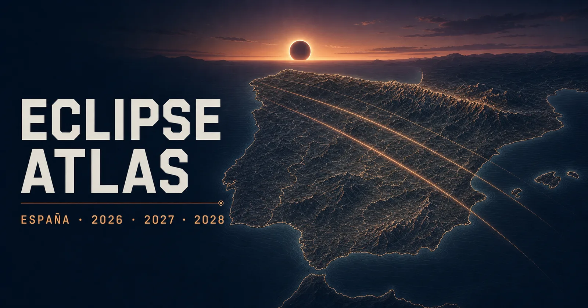

# Eclipse Atlas

[](https://github.com/jgorostegui/eclipse-atlas/actions/workflows/ci.yml)
[](https://jgorostegui.github.io/eclipse-atlas/)
[](LICENSE)

[](https://jgorostegui.github.io/eclipse-atlas/)

Eclipse Atlas is an interactive planning map for the solar eclipses visible across
Spain in 2026, 2027 and 2028. It brings eclipse geometry, the western terrain horizon
and atmospheric data into one bilingual interface while keeping each source of evidence
separate.

**[Open Eclipse Atlas](https://jgorostegui.github.io/eclipse-atlas/)**

## Features

- Explore the total eclipses of 12 August 2026 and 2 August 2027, and the annular
  eclipse of 26 January 2028.
- View regional layers for central-phase duration, shadow passage, maximum obscuration
  and solar altitude.
- Select a saved reference, click the map, enter coordinates or use your current
  location.
- Inspect local contact times, eclipse circumstances and the western terrain horizon.
- See the Sun and Moon against an elevation profile calculated from IGN/CNIG data.
- Compare up to three locations without reducing astronomy, terrain and weather to a
  single score.
- Review August cloud climatology and event-day forecasts when they become available.
- Share the selected event, location, comparison and map layer through the page URL.
- Use the application in English or Spanish on desktop, tablet and mobile.

Saved places are approximate planning references, not endorsed viewing venues. The map
does not determine access, capacity, nearby obstacles or current local conditions.

## Run locally

Eclipse Atlas requires Node.js 22.13 or later and npm.

```bash
git clone https://github.com/jgorostegui/eclipse-atlas.git
cd eclipse-atlas
npm ci
npm run dev
```

Open [http://localhost:3000](http://localhost:3000).

Build and preview the production application with:

```bash
npm run build
npm run preview
```

## Quality checks

Run the project checks:

```bash
npm run check
```

Run the functional browser tests after an interface change:

```bash
npm run test:ui
```

The CI workflow runs both commands before publishing the application to GitHub Pages.

## Data and sources

Eclipse calculations, terrain, map layers and atmospheric context come from separately
identified public sources. Their producers, licences, transformations and limitations
are documented in [SOURCES.md](SOURCES.md) and the machine-readable
[source catalog](public/sources.json).

Terrain data cannot account for every building, tree or temporary obstruction. Climate
summaries are not forecasts, and forecasts do not change the eclipse geometry. Confirm
field conditions, access and organizer information before travelling.

## Contributing

Read [CONTRIBUTING.md](CONTRIBUTING.md) before proposing a change. Changes to public data
or scientific behaviour should include tests and provenance updates.

Report security issues according to [SECURITY.md](SECURITY.md).

## License

Eclipse Atlas is available under the [MIT License](LICENSE). Runtime dependency notices
are listed in [THIRD_PARTY_NOTICES.md](THIRD_PARTY_NOTICES.md).
